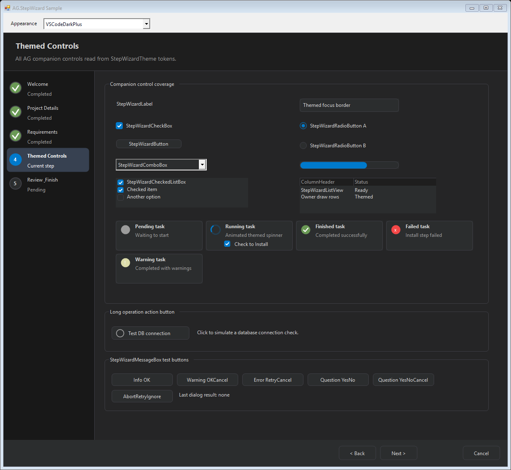
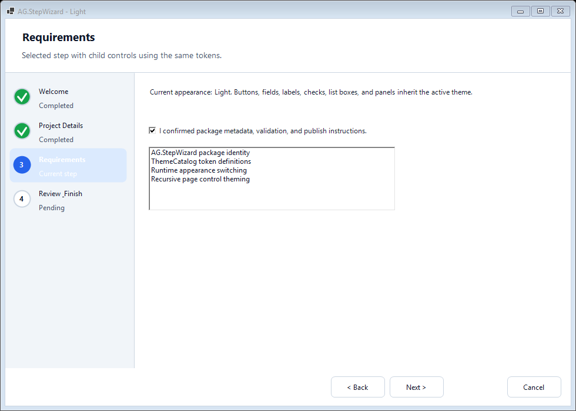
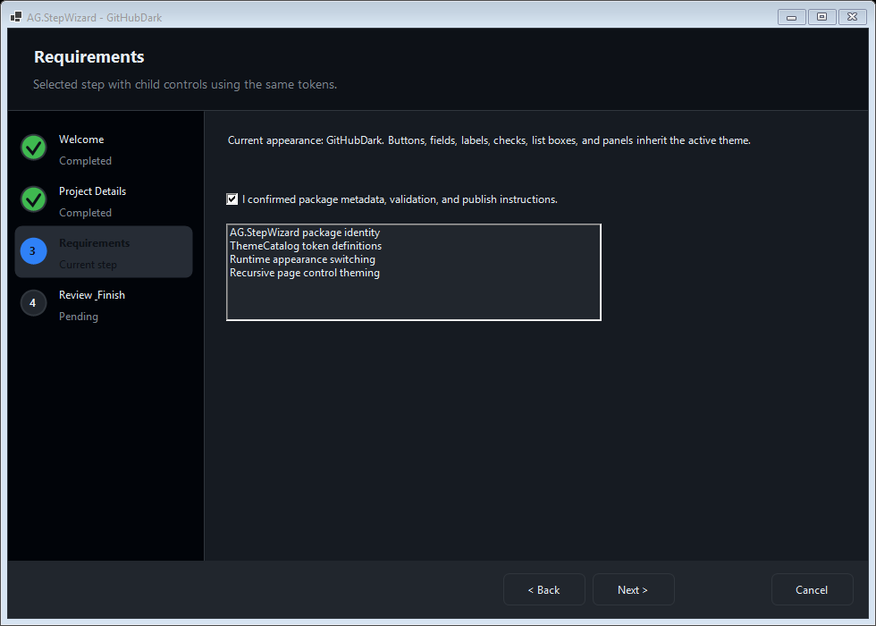
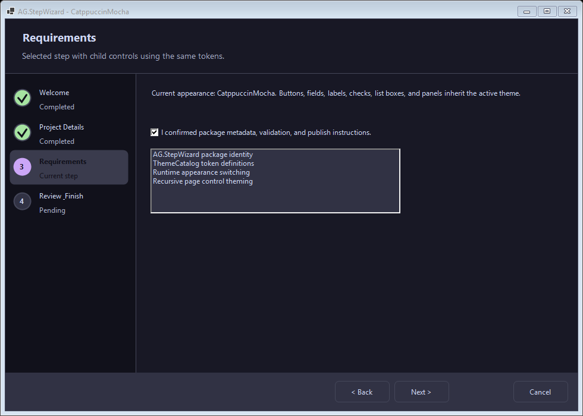
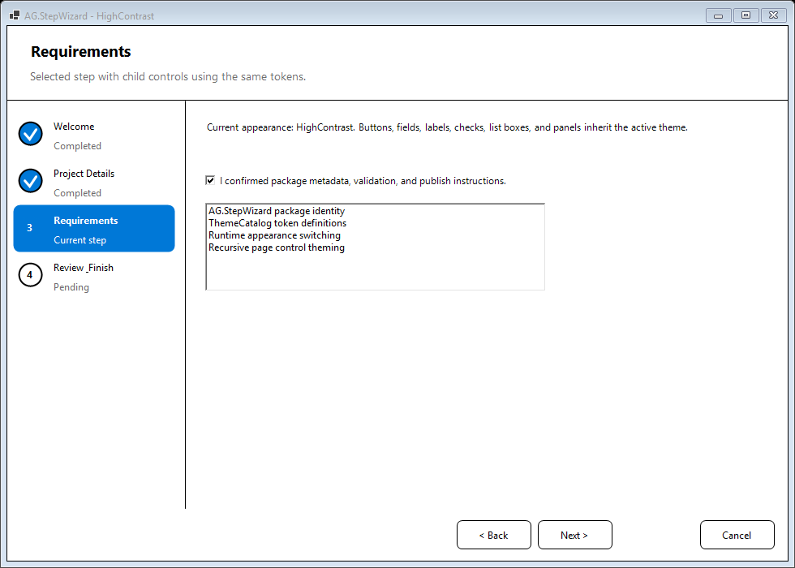

# AG.StepWizard
[](https://github.com/ademgashi/AG.StepWizard/actions/workflows/ci.yml)
[](https://www.nuget.org/packages/AG.StepWizard)

AG.StepWizard is a modern themed WinForms step wizard control for .NET Framework 4.7. It provides page hosting, a left step list, header, footer navigation, validation events, and a token-based theme catalog with light, dark, system, high contrast, Catppuccin, Solarized, Nord, Dracula, GitHub, Visual Studio, Fluent, and other editor-inspired appearances.

This project was derived from the MIT-licensed AeroWizard project and intentionally removes the old Aero-style controls, Visual Styles rendering, VSIX templates, and generated documentation surface.

## Screenshots

The sample wizard is rendered for every built-in appearance under `docs/screenshots`.



The controls showcase includes themed companion controls, task status cards, `StepWizardActionButton` long-operation states, and `StepWizardMessageBox` test buttons.

| Light | GitHub Dark |
| --- | --- |
|  |  |

| Catppuccin Mocha | High Contrast |
| --- | --- |
|  |  |

Additional screenshots include `controls-showcase.png`, `system.png`, `dark.png`, `oled-black.png`, `blue-dark.png`, `catppuccin-latte.png`, `catppuccin-frappe.png`, `catppuccin-macchiato.png`, `monokai.png`, `solarized-light.png`, `solarized-dark.png`, `linear.png`, `notion.png`, `openclaw.png`, `matrix.png`, `one-dark.png`, `dracula.png`, `nord.png`, `gruvbox-dark.png`, `gruvbox-light.png`, `tokyo-night.png`, `github-light.png`, `vscode-dark-plus.png`, `visual-studio-blue.png`, `visual-studio-dark.png`, `fluent-light.png`, `fluent-dark.png`, and `windows-classic.png`.

## Install

```bash
dotnet add package AG.StepWizard --version 1.3.0
```

## Basic Usage

```csharp
using AG.StepWizard;

var wizard = new StepWizardControl
{
    Dock = DockStyle.Fill,
    HeaderTitle = "Setup",
    HeaderSubtitle = "Complete the setup steps.",
    Appearance = StepWizardAppearance.System
};

wizard.Pages.Add(new StepWizardPage
{
    Title = "Welcome",
    Subtitle = "Start here."
});

wizard.Pages.Add(new StepWizardPage
{
    Title = "Finish",
    Subtitle = "Review and finish.",
    IsFinishPage = true
});

wizard.PageValidating += (sender, e) =>
{
    // Set e.Cancel = true to stop Next or Finish.
};

wizard.FinishButtonClick += (sender, e) =>
{
    StepWizardMessageBox.Show(wizard, "Finished.", "Done", MessageBoxButtons.OK, MessageBoxIcon.Information);
};
```

## Optional Pages

Use `StepWizardPage.Suppress` to keep a page in `Pages` while hiding it from the runtime flow:

```csharp
threeServerPage.Suppress = installMode == InstallMode.SingleServer;
```

Suppressed pages are skipped by Back and Next, hidden from the left step list, and ignored when deciding whether the selected page should show Finish. The page remains in the collection so code can turn it back on later, and the Visual Studio designer can still select it from the smart tag or page collection editor.

## Appearance

Use `Appearance` for built-in modes:

```csharp
wizard.Appearance = StepWizardAppearance.Dark;
```

Available modes:

- `System`: uses Windows high contrast when enabled, otherwise attempts Windows app light/dark theme detection.
- `Light`: forces the light theme.
- `Dark`: forces the dark theme.
- `OLEDBlack`: forces a pure black OLED-friendly theme.
- `BlueDark`: forces the polished blue/dark theme.
- `CatppuccinLatte`
- `CatppuccinFrappe`
- `CatppuccinMacchiato`
- `CatppuccinMocha`
- `Monokai`
- `SolarizedLight`
- `SolarizedDark`
- `Linear`
- `Notion`
- `OpenClaw`
- `Matrix`
- `OneDark`
- `Dracula`
- `Nord`
- `GruvboxDark`
- `GruvboxLight`
- `TokyoNight`
- `GitHubLight`
- `GitHubDark`
- `VSCodeDarkPlus`
- `VisualStudioBlue`
- `VisualStudioDark`
- `FluentLight`
- `FluentDark`
- `WindowsClassic`
- `HighContrast`: forces accessible high contrast colors and strong borders.

System detection uses .NET Framework-compatible Windows registry lookup. If detection is unavailable or fails, the control safely falls back to `Light`.

## Custom Theme

Use `Theme` when you need exact brand colors:

```csharp
wizard.Theme = new StepWizardTheme
{
    Name = "Brand Light",
    IsDark = false,
    WindowBack = Color.WhiteSmoke,
    ContentBack = Color.White,
    HeaderBack = Color.White,
    SidebarBack = Color.WhiteSmoke,
    CardBack = Color.White,
    Border = Color.LightGray,
    Text = Color.Black,
    MutedText = Color.DimGray,
    Accent = Color.RoyalBlue,
    AccentText = Color.White,
    HoverBack = Color.AliceBlue,
    SelectedBack = Color.LightBlue,
    DisabledText = Color.Gray,
    Success = Color.Green,
    Warning = Color.DarkOrange,
    Error = Color.Firebrick
};
```

Built-in themes live in `ThemeCatalog`:

```csharp
wizard.Theme = ThemeCatalog.CatppuccinMocha;
```

Every built-in theme is defined as semantic `WizardTheme` tokens, so rendered wizard surfaces read from `WindowBack`, `ContentBack`, `HeaderBack`, `SidebarBack`, `CardBack`, `Border`, `Text`, `MutedText`, `Accent`, `AccentText`, `HoverBack`, `SelectedBack`, `DisabledText`, `Success`, `Warning`, and `Error` instead of control-specific hardcoded colors.

Assigning `Appearance` after a custom `Theme` switches back to the built-in theme pipeline. Set `UseTheme = false` to use the conservative light fallback.

## Page Control Theming

Controls hosted inside `StepWizardPage` inherit the active theme by default:

```csharp
wizard.ThemePageControls = true;
```

The wizard recursively applies token colors to common WinForms child controls such as `Label`, `TextBox`, `ComboBox`, `ListBox`, `CheckBox`, `RadioButton`, `Button`, `Panel`, `TableLayoutPanel`, `FlowLayoutPanel`, `GroupBox`, `LinkLabel`, `TreeView`, and `ListView`. Controls added at runtime are themed as they are inserted. Set `ThemePageControls = false` when a page uses fully custom styling.

For full token-based rendering, use the AG companion controls:

- `StepWizardLabel`
- `StepWizardTextBox`
- `StepWizardCheckBox`
- `StepWizardRadioButton`
- `StepWizardGroupBox`
- `StepWizardButton`
- `StepWizardActionButton`
- `StepWizardCheckedListBox`
- `StepWizardListView`
- `StepWizardComboBox`
- `StepWizardProgressBar`
- `StepWizardToolTip`
- `StepWizardTaskItemControl`
- `StepWizardMessageBox`

Controls implementing `IStepWizardThemeAware` are automatically themed when they are placed inside a `StepWizardPage` and `ThemePageControls` is enabled.

`StepWizardTaskItemControl` provides a themed task row with `Text`, `ProgressText`, `Status`, `ShowInstallCheck`, `InstallChecked`, and `InstallCheckedChanged`. Running status is drawn with a theme-colored animated indicator, so no external GIF is required.

`StepWizardActionButton` is useful for long operations such as testing a database connection. Set `State` to `Running` while work is in progress, then switch to `Success`, `Error`, or `Warning` when the operation completes:

```csharp
testConnectionButton.BeginOperation();

try
{
    await TestConnectionAsync();
    testConnectionButton.SetSuccess();
}
catch
{
    testConnectionButton.SetError();
}
```

## Themed Dialogs

`MessageBox.Show` is a native Windows dialog and cannot be reliably recolored by WinForms. Use `StepWizardMessageBox` when dialogs should match the active wizard theme:

```csharp
StepWizardMessageBox.Show(
    this,
    wizard.Theme,
    "Enter a project name before continuing.",
    "Validation",
    MessageBoxButtons.OK,
    MessageBoxIcon.Warning);
```

`StepWizardMessageBox` supports the common modal dialog options from `MessageBox.Show`: owner window, caption, `MessageBoxButtons`, `MessageBoxIcon`, `MessageBoxDefaultButton`, `MessageBoxOptions.RightAlign`, `MessageBoxOptions.RtlReading`, keyboard Accept/Cancel behavior, and `DialogResult` return values. Native file/folder dialogs remain native Windows dialogs.

Dialog icons are drawn from theme tokens:

- information and question use `Accent`
- warning uses `Warning`
- error uses `Error`

## Sample App

Open `src/AG.StepWizard.sln` and run `AG.StepWizard.Sample`.

The sample demonstrates:

- runtime appearance switching
- optional page suppression
- five wizard pages
- validation before Next
- Finish and Cancel handling
- companion controls including `StepWizardActionButton`
- themed `StepWizardMessageBox` icons and button combinations
- themed header, footer, buttons, page background, borders, step list, selected step, and completed indicators
- every built-in appearance exposed by `StepWizardAppearance`

## Build

Preferred .NET Framework build:

```bash
nuget restore src/AG.StepWizard.sln
msbuild src/AG.StepWizard.sln /p:Configuration=Release
```

Pack:

```bash
dotnet pack src/AG.StepWizard/AG.StepWizard.csproj -c Release -o ./artifacts
```

Publish with NuGet Trusted Publishing from GitHub Actions:

1. On nuget.org, open your account menu and choose **Trusted Publishing**.
2. Add a GitHub Actions policy:
   - Repository Owner: `ademgashi`
   - Repository: `AG.StepWizard`
   - Workflow File: `release.yml`
   - Environment: `nuget`
3. In GitHub, create an environment named `nuget`.
4. In GitHub repo variables, add `NUGET_USER` with the nuget.org username of the person who created the Trusted Publishing policy.
5. Create and push a version tag such as `v1.3.0`, publish a GitHub release, or run the `Release` workflow manually.

The release workflow requests a short-lived NuGet publishing key using GitHub OIDC and `NuGet/login@v1`; no long-lived API key is stored in GitHub.

Manual command-line publishing with an API key still works for unsupported workflows:

```bash
dotnet nuget push ./artifacts/AG.StepWizard.1.3.0.nupkg --api-key YOUR_NUGET_API_KEY --source https://api.nuget.org/v3/index.json
```

## Migration From AeroWizard

AG.StepWizard is not a drop-in replacement for AeroWizard. It intentionally keeps only the Step Wizard-style control and renames the public API:

- namespace changes to `AG.StepWizard`
- `WizardPage` becomes `StepWizardPage`
- AeroWizard-style page suppression maps to `StepWizardPage.Suppress`
- `StepWizardControl` remains the main control name
- Aero/classic wizard, Visual Styles, DWM, taskbar, VSIX templates, and generated HTML docs are removed
- theming is controlled by `Appearance` and `StepWizardTheme`

## Designer Support

The control includes Visual Studio WinForms designer support for .NET Framework 4.7 through the standard `System.Design` designer assembly:

- drag `StepWizardControl` from the toolbox onto a form
- use the designer verbs or smart tag to add, insert, remove, and navigate pages
- click the rendered Back, Next, and Finish buttons at design time to switch the selected page
- use the `Go to page` smart-tag dropdown to jump directly to a page
- edit `Appearance`, `StepListWidth`, `HeaderTitle`, `HeaderSubtitle`, `ShowCancelButton`, `ShowFinishButton`, `ThemePageControls`, and other public properties in the Properties window
- expand `Theme` in the Properties window to inspect/edit semantic theme tokens
- add controls to the currently selected `StepWizardPage` through normal WinForms designer workflows

Runtime `System` appearance detection is intentionally conservative on .NET Framework 4.7; use explicit `Appearance` values when deterministic rendering is required in the designer.

## Branching

This repository uses a main-based release flow with GitFlow-style branch names:

- `main`: protected, release-ready, tagged versions only
- `develop`: integration branch
- `feature/*`: feature work
- `fix/*`: bug fixes
- `release/*`: release stabilization
- `hotfix/*`: urgent fixes from `main`

See `CONTRIBUTING.md` for details.
